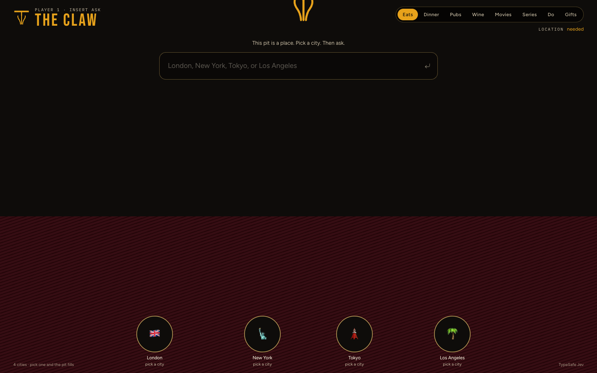
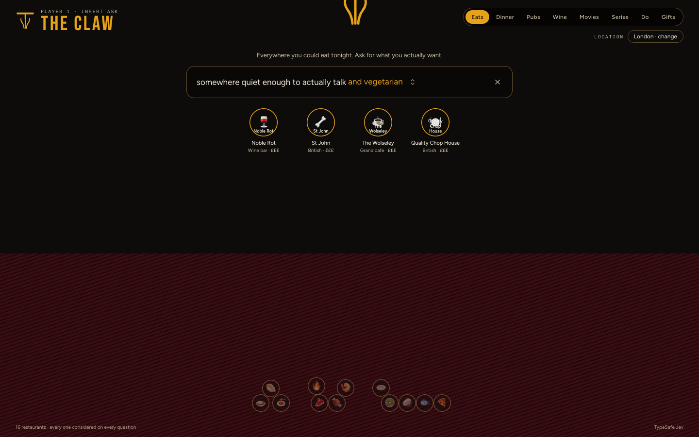

# THE CLAW

Ask for the night you want. The claw lifts what fits.

Eight pits: **Eats, Dinner, Pubs, Wine, Movies, Series, Do, Gifts**. Eats, Pubs, and Do ask for a city first. TypeSafe Jev weighs every prize in the pit. MIT. Built by [ASV Labs](https://github.com/ASV-Labs) on the WDI playable-first-screen composition.

<p align="center">
  
</p>
<p align="center">
  
</p>

## Run it

```bash
git clone https://github.com/ASV-Labs/the-claw.git
cd the-claw
npm install
cp .env.example .env.local
# optional: TYPESAFE_API_KEY from https://console.typesafe.ai
npm run dev
```

Open [http://127.0.0.1:3027](http://127.0.0.1:3027).

Without a key, a local heuristic still moves the pit. Keys stay on the server.

## Design gate

- `design-note.md` — WDI-010
- `wdi-011-score-sheet.md` — builder self-review (draft)

Catalogs are a September 2026 snapshot. Names of restaurants, films, and services belong to their owners.

## License

[MIT](LICENSE).
